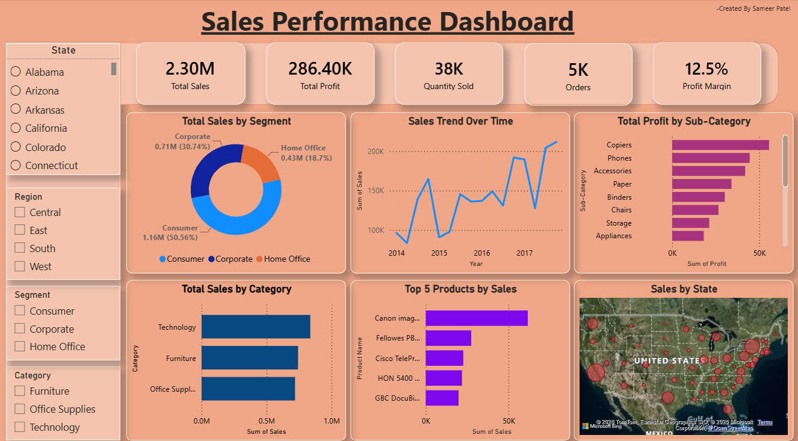

# Superstore Sales Dashboard

##Overview
An interactive sales dashboard built using Power BI.

## Tools Used
-Power BI
-Microsoft Excel
-Power Query
-DAX

## KPIs
-Total Sales
-Total Profit
-Total Orders
-Quantity Sold
-Profit Margin

## Visuals
-Sales By Category
-Profit By Sub-Category
-Sales Trend By Years
-Top 5 Products
-Sales By State
-Interactive Slicers

## Dashboard Preview

